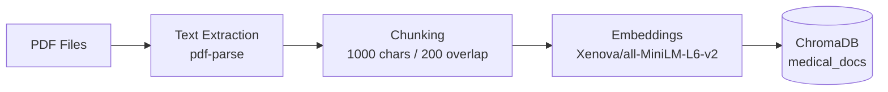
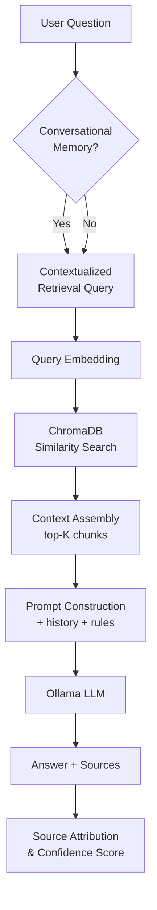

# Medical RAG Assistant

A **Retrieval-Augmented Generation (RAG)** application for medical document question answering. Upload PDF clinical guidelines, index them into a local vector database, and ask grounded questions with source attribution, confidence scoring, and an interactive evidence viewer — powered by **Next.js**, **ChromaDB**, **Xenova embeddings**, and **Ollama** for local LLM inference.

---

## Features

- **PDF Upload** — Drag-and-drop upload via the UI (`/api/upload`) with automatic ingestion
- **PDF Parsing** — Text extraction from PDFs using `pdf-parse` / `pdfjs-dist`
- **Document Chunking** — Recursive character splitting (1,000 chars, 200 overlap) via LangChain
- **Embeddings Generation** — Local `Xenova/all-MiniLM-L6-v2` sentence embeddings (mean pooling, L2-normalized)
- **ChromaDB Vector Search** — Semantic similarity search over the `medical_docs` collection
- **Retrieval-Augmented Generation** — Context-grounded answers with strict citation rules
- **Local LLM Inference with Ollama** — No cloud API keys required; model configurable via `OLLAMA_MODEL` (default `qwen2.5:7b`)
- **Source Attribution** — Grounded answers include retrieved document chunks with similarity scores (empty when nothing is retrieved)
- **Evidence Viewer** — Slide-out drawer with full chunk text, metadata, and query highlighting
- **PDF Viewer** — In-browser PDF rendering with page-level navigation to source evidence
- **Confidence Scoring** — Answer confidence derived from average retrieval similarity (High / Medium / Low)
- **Answer Explainability** — Pipeline visualization and retrieval reasoning per answer
- **Analytics Dashboard** — System stats, session metrics, latency bar charts, and similarity trend sparkline
- **Debug Mode** — Inspect prompts, retrieved chunks, timings, and model configuration
- **Conversational Memory** — Up to 10 exchange pairs persisted in `localStorage` for follow-up questions
- **Cross-Document Search** — Standard mode queries the full `medical_docs` index (all PDFs); research mode adds parallel queries, more chunks, and document-grouped synthesis (see [docs/MULTI_DOCUMENT_RETRIEVAL.md](docs/MULTI_DOCUMENT_RETRIEVAL.md))
- **Comparison Mode** — Auto-detected side-by-side topic comparison (e.g. "diabetes vs hypertension")
- **Evaluation Lab** — Dedicated `/evaluation` page for pipeline testing and run history
- **Document Library** — Browse indexed library and uploaded documents with chunk counts
- **Query Suggestions** — Starter prompts for factual and research-style questions
- **Answer Sanitization** — Strips meta-leakage and dangling table/figure references from LLM output

---

## Architecture Overview

The RAG pipeline follows a linear flow from document ingestion through grounded answer generation:

```
PDF → Chunking → Embeddings → ChromaDB → Retrieval → Prompt Construction → Ollama → Answer Generation → Source Attribution
```

### Ingestion Pipeline



### Query Pipeline



### Application Layers

```mermaid
flowchart TB
    subgraph frontend [Next.js Frontend]
        UI[Chat UI]
        EV[Evidence Drawer]
        PDF[PDF Viewer]
        AD[Analytics Dashboard]
        EL[Evaluation Lab]
    end

    subgraph api [API Routes]
        CHAT[/api/chat]
        UP[/api/upload]
        DOC[/api/documents]
        ST[/api/stats]
        PDFAPI[/api/pdf]
        CHUNK[/api/sources/chunk]
    end

    subgraph core [Core Libraries]
        RAG[rag.ts]
        RET[retrieve.ts]
        EMB[embeddings.ts]
        CHR[chroma.ts]
        ING[ingest.ts]
    end

    subgraph external [External Services]
        OLL[Ollama :11434]
        CHDB[(ChromaDB :8000)]
    end

    UI --> CHAT
    EV --> CHUNK
    PDF --> PDFAPI
    AD --> ST
    EL --> CHAT

    CHAT --> RAG
    UP --> ING
    DOC --> CHR
    ST --> CHR

    RAG --> RET
    RAG --> OLL
    RET --> EMB
    RET --> CHR
    ING --> EMB
    ING --> CHR
    CHR --> CHDB
```

---

## Tech Stack

### Frontend

| Technology | Purpose |
|---|---|
| [Next.js 16](https://nextjs.org) | App Router and API routes |
| [React 19](https://react.dev) | UI components |
| [TypeScript 5](https://www.typescriptlang.org) | Type-safe codebase |
| [Tailwind CSS 4](https://tailwindcss.com) | Styling |
| [Framer Motion](https://www.framer.com/motion/) | Animations |
| [react-pdf](https://www.npmjs.com/package/react-pdf) | In-browser PDF rendering |
| [react-markdown](https://www.npmjs.com/package/react-markdown) | Markdown answer rendering |

### AI & Embeddings

| Technology | Purpose |
|---|---|
| [Ollama](https://ollama.com) | Local LLM inference |
| Any Ollama model (`OLLAMA_MODEL`) | Answer generation (default `qwen2.5:7b`) |
| `llama3.2:3b`, `qwen2.5:7b` | Referenced in `.env.example` and `npm run test:models` |
| [@xenova/transformers](https://www.npmjs.com/package/@xenova/transformers) | Local embedding generation |
| `Xenova/all-MiniLM-L6-v2` | Sentence embeddings for queries and documents |

### Vector Database

| Technology | Purpose |
|---|---|
| [ChromaDB 3](https://www.trychroma.com) | Vector storage and similarity search |
| Collection `medical_docs` | Persistent document index |

### Backend & Tooling

| Technology | Purpose |
|---|---|
| Next.js API Routes | REST endpoints |
| [@langchain/textsplitters](https://js.langchain.com) | Document chunking (`RecursiveCharacterTextSplitter`) |
| [pdf-parse](https://www.npmjs.com/package/pdf-parse) | Server-side PDF text extraction |
| [tsx](https://www.npmjs.com/package/tsx) | TypeScript script runner |

---

## Project Structure

```
medical-rag/
├── src/
│   ├── app/                    # Next.js App Router
│   │   ├── page.tsx            # Main chat interface
│   │   ├── evaluation/         # Evaluation Lab page
│   │   ├── layout.tsx          # Root layout and metadata
│   │   ├── globals.css         # Global styles
│   │   └── api/                # REST API routes
│   │       ├── chat/           # RAG question answering
│   │       ├── upload/         # PDF upload + ingest
│   │       ├── documents/      # Document library listing
│   │       ├── stats/          # System statistics
│   │       ├── pdf/            # PDF file serving
│   │       └── sources/chunk/  # Chunk lookup by reference
│   ├── components/             # React UI components
│   │   ├── chat/               # Chat thread, composer, answer cards, debug panel
│   │   ├── evaluation/         # Evaluation Lab panels and visualizations
│   │   ├── ui/                 # Shared design system primitives
│   │   ├── DocumentLibrary.tsx      # Document browser
│   │   ├── DocumentUpload.tsx       # PDF upload widget
│   │   ├── EvidenceDrawer.tsx         # Evidence slide-out panel
│   │   ├── PDFViewerModal.tsx       # In-browser PDF viewer
│   │   ├── RagAnalyticsDashboard.tsx # Session/system analytics
│   │   ├── QuerySuggestions.tsx     # Starter prompts
│   │   ├── ConfidenceIndicator.tsx  # Confidence display
│   │   └── SourceCard.tsx           # Source citation card
│   ├── hooks/                  # Custom React hooks (memory, evidence, PDF viewer)
│   ├── lib/                    # Core business logic
│   │   ├── rag.ts              # RAG pipeline orchestration
│   │   ├── retrieve.ts         # ChromaDB similarity search
│   │   ├── embeddings.ts       # Xenova embedding generation
│   │   ├── chroma.ts           # ChromaDB client and collection
│   │   ├── ingest.ts           # PDF ingestion pipeline
│   │   ├── memory-service.ts   # Conversational memory management
│   │   ├── research-mode.ts    # Research and comparison mode detection
│   │   ├── answer-sanitizer.ts # LLM output post-processing
│   │   └── ...                 # PDF, stats, explainability, analytics utilities
│   └── types/                  # TypeScript type definitions
├── scripts/                    # CLI utilities
│   ├── ingest.ts               # Batch ingest all PDFs in docs/
│   ├── reset-ingest.ts         # Clear uploads + Chroma, re-ingest library
│   ├── test.ts                 # Retrieval-only smoke test
│   ├── rag-test.ts             # End-to-end RAG smoke test
│   ├── memory-test.ts          # Conversational memory test
│   └── model-benchmark.ts      # Compare Ollama models on benchmark cases
├── docs/                       # PDF document library
│   └── uploads/                # User-uploaded PDFs (auto-ingested)
├── chroma/                     # ChromaDB persistent storage (generated, gitignored)
├── public/                     # Static assets served by Next.js
├── package.json                # Dependencies and npm scripts
├── .env.local                  # Local environment config (create manually; gitignored)
├── next.config.ts              # Next.js configuration
└── tsconfig.json               # TypeScript configuration
```

---

## Installation

### Prerequisites

| Requirement | Notes |
|---|---|
| **Node.js** | Project uses `@types/node` ^20 |
| **npm** | Installs dependencies from `package.json` |
| **Ollama** | [Install from ollama.com](https://ollama.com/download); pull the model set in `OLLAMA_MODEL` |

### 1. Clone and install dependencies

```bash
git clone <repository-url>
cd medical-rag
npm install
```

### 2. Configure environment

Create `.env.local` in the project root (Next.js loads it automatically). A template also exists locally as `.env.example`, but that file is gitignored — do not rely on it being present after clone.

```bash
cat > .env.local << 'EOF'
OLLAMA_MODEL=qwen2.5:7b
OLLAMA_BASE_URL=http://localhost:11434
OLLAMA_THINK=false
OLLAMA_TIMEOUT_MS=300000
RESEARCH_OLLAMA_TIMEOUT_MS=360000
COMPARISON_OLLAMA_TIMEOUT_MS=480000
CHROMA_HOST=localhost
CHROMA_PORT=8000
EOF
```

Edit `.env.local` if needed; the values above work for local development.

### 3. Install and start Ollama

Install Ollama from [https://ollama.com/download](https://ollama.com/download), then pull a model:

```bash
# Default in .env.local
ollama pull qwen2.5:7b

# Alternative referenced in .env.example and test:models
ollama pull llama3.2:3b
```

Verify Ollama is running:

```bash
curl http://localhost:11434/api/tags
```

### 4. Start ChromaDB

ChromaDB is bundled with the `chromadb` npm package. Start the server in a separate terminal:

```bash
npm run chroma:server
```

Verify it is healthy:

```bash
npm run chroma:status
# → Chroma is running on http://localhost:8000
```

### 5. Add documents and ingest

Place PDF files directly in the `docs/` directory (sample medical PDFs may already be included). **ChromaDB must be running** (step 4) before ingestion.

```bash
npm run ingest
```

`npm run ingest` processes only `docs/*.pdf` at the top level — not files in `docs/uploads/` (those are ingested automatically via `POST /api/upload`).

Expected output (counts vary by document size):

```
Found 3 PDFs

Processing 1.-diabetes-24-04-19 (1).pdf
Created 18 chunks

Processing IRQ_D1_Hypertension-MOH.pdf
Created 123 chunks

Processing dsa509.pdf
Created 92 chunks

Generating embeddings...

Stored 233 vectors in ChromaDB
Done
```

---

## Environment Variables

Create or edit `.env.local` in the project root:

```bash
# Ollama LLM
OLLAMA_MODEL=qwen2.5:7b
OLLAMA_BASE_URL=http://localhost:11434
OLLAMA_THINK=false

# Timeouts (milliseconds) — CPU inference needs longer for 7B models
OLLAMA_TIMEOUT_MS=300000
RESEARCH_OLLAMA_TIMEOUT_MS=360000
COMPARISON_OLLAMA_TIMEOUT_MS=480000

# ChromaDB
CHROMA_HOST=localhost
CHROMA_PORT=8000

# Pipeline logging (development)
# RAG_LOG=true

# Hybrid retrieval V2 (BM25 + vector + RRF)
# ENABLE_HYBRID_RETRIEVAL=true
```

| Variable | Default | Description |
|---|---|---|
| `OLLAMA_MODEL` | `qwen2.5:7b` | Ollama model tag for answer generation |
| `OLLAMA_BASE_URL` | `http://localhost:11434` | Ollama API endpoint |
| `OLLAMA_THINK` | `false` | Enable Ollama reasoning/thinking output |
| `OLLAMA_TIMEOUT_MS` | `300000` (5 min) | Timeout for standard Q&A requests |
| `RESEARCH_OLLAMA_TIMEOUT_MS` | `360000` (6 min) | Timeout for research/synthesis mode |
| `COMPARISON_OLLAMA_TIMEOUT_MS` | `480000` (8 min) | Timeout for comparison mode |
| `CHROMA_HOST` | `localhost` | ChromaDB server hostname |
| `CHROMA_PORT` | `8000` | ChromaDB server port |
| `CHROMA_SSL` | `false` | Use HTTPS for ChromaDB connection |
| `RAG_LOG` | auto in dev | Set `true` to force pipeline logging; `false` to suppress |
| `BENCHMARK_MODELS` | `llama3.2:3b,qwen2.5:7b` | Comma-separated models for `npm run test:models` |
| `ENABLE_HYBRID_RETRIEVAL` | `false` | Enable V2 hybrid retrieval (BM25 + vector + RRF) |
| `HYBRID_BM25_TOP_K` | `15` | BM25 candidates per planned query |
| `HYBRID_VECTOR_TOP_K` | `15` | Vector candidates per planned query |
| `HYBRID_RRF_K` | `60` | Reciprocal Rank Fusion constant |
| `HYBRID_FUSION_TOP_K` | `40` | Fused candidates after global merge |
| `HYBRID_DIVERSITY_TOP_K` | `20` | Chunks after diversity selection |
| `HYBRID_FINAL_TOP_K` | `12` | Final chunks sent to LLM |
| `HYBRID_MAX_PER_DOCUMENT` | `3` | Max chunks per PDF (preferred: 2) |
| `HYBRID_CONTEXT_TARGET_TOKENS` | `4000` | Target context size (tokens) |
| `HYBRID_CONTEXT_MAX_TOKENS` | `6000` | Maximum context size (tokens) |

All hybrid tuning is centralized in `src/lib/search/retrieval.config.ts`.

### Model guidance (from `.env.example` comments)

| Model | Notes in repository |
|---|---|
| `qwen2.5:7b` | Default `OLLAMA_MODEL`; described as best RAG instruction-following |
| `llama3.2:3b` | Described as fast fallback; used by `npm run test:models` |
| `qwen3:4b` | Described as not recommended; `rag.ts` applies Qwen3-specific prompt handling via `isQwen3Model()` |

---

## Running The Project

You need **three terminals** for full local development. Start them in this order:

**Terminal 1 — ChromaDB** (required before ingest or chat):

```bash
npm run chroma:server
```

**Terminal 2 — Ingest documents** (required before first use; re-run after adding PDFs to `docs/`):

```bash
npm run ingest
```

**Terminal 3 — Next.js dev server:**

```bash
npm run dev
```

Open [http://localhost:3000](http://localhost:3000) in your browser.

> **Note:** Ollama must also be running with the configured model pulled (see [Installation](#3-install-and-start-ollama)). The chat UI will fail to generate answers without it, even if ingestion succeeded.

### npm Scripts

| Command | Description |
|---|---|
| `npm run dev` | Start Next.js development server on port 3000 |
| `npm run build` | Production build |
| `npm run start` | Start production server (requires `build` first) |
| `npm run lint` | Run ESLint |
| `npm run chroma:server` | Start ChromaDB on `localhost:8000` with persistent storage in `./chroma` |
| `npm run chroma:stop` | Kill process on port 8000 |
| `npm run chroma:status` | Check whether ChromaDB is running and responding |
| `npm run chroma:reset` | Stop Chroma and wipe vector store data |
| `npm run ingest` | Parse, chunk, embed, and index all `docs/*.pdf` (top-level only; requires ChromaDB) |
| `npm run reset:ingest` | Clear `docs/uploads/`, delete Chroma collection, re-ingest `docs/*.pdf` (requires ChromaDB) |
| `npm run test:retrieval` | Smoke test vector search (requires ChromaDB; no LLM) |
| `npm run test:rag` | End-to-end RAG pipeline smoke test (requires ChromaDB + Ollama) |
| `npm run test:memory` | Test conversational memory and follow-up retrieval (requires ChromaDB + Ollama) |
| `npm run test:models` | Benchmark multiple Ollama models (requires ChromaDB + Ollama) |

---

## PDF Ingestion Pipeline

### 1. Upload

PDFs enter the system two ways:

- **Library documents** — Place files directly in `docs/`, then run `npm run ingest`
- **UI upload** — Use the upload panel; files are saved to `docs/uploads/` and ingested immediately via `POST /api/upload` (no separate `npm run ingest` needed)

Constraints: PDF only, max 25 MB per file.

### 2. Parsing

`pdf-parse` extracts plain text from each page. The PDF.js worker is configured automatically. Files with no extractable text are rejected.

### 3. Chunking

LangChain's `RecursiveCharacterTextSplitter` splits text into overlapping segments:

- **Chunk size:** 1,000 characters
- **Overlap:** 200 characters
- **Chunk ID format:** `doc-{sanitized-basename}-chunk-{index}` for library PDFs; `upload-{sanitized-basename}-chunk-{index}` for uploads (non-alphanumeric characters in filenames are replaced with `-`)

### 4. Embedding Generation

Each chunk is embedded locally using `Xenova/all-MiniLM-L6-v2`:

- Mean pooling with L2 normalization (`embeddings.ts`)
- Processed in batches of 16 (`EMBED_BATCH_SIZE` in `ingest.ts`)

On first run, the model weights are downloaded and cached by `@xenova/transformers`.

### 5. ChromaDB Storage

Embeddings are upserted into the `medical_docs` collection with metadata:

```json
{
  "filename": "IRQ_D1_Hypertension-MOH.pdf",
  "chunkIndex": 12
}
```

Upserts happen in batches of 100. Re-running `npm run ingest` updates existing chunks (same IDs).

---

## Retrieval Flow

### 1. User Query

The user submits a question via the chat interface. Optional conversational history (up to 10 exchanges) is included.

### 2. Query Enhancement

- **Follow-up expansion** — `expandFollowUpForRetrieval()` prepends the last user turn for pronoun-style follow-ups
- **Topic-aware boosts** — `buildRetrievalQuery()` adds symptom/diagnosis terms when the question matches those intents
- **Research mode (V1)** — `retrieveChunksForResearch()` runs parallel queries (4 chunks each, merged up to 10)
- **Comparison mode (V1)** — `retrieveChunksForComparison()` retrieves 5 chunks per detected topic
- **Hybrid retrieval (V2)** — when `ENABLE_HYBRID_RETRIEVAL=true`: planner → BM25 + vector → RRF → diversity → rerank. See [docs/HYBRID_RETRIEVAL.md](docs/HYBRID_RETRIEVAL.md)

### 3. Embedding Generation

The (possibly enhanced) query is embedded with the same `Xenova/all-MiniLM-L6-v2` model used during ingestion.

### 4. Similarity Search

ChromaDB performs L2 distance search over the **entire** `medical_docs` collection — there is no per-document filter in standard mode. The top-K hits are the globally most similar chunks; they may all come from one PDF or span several files.

Distances are converted to cosine similarity scores:

```
similarity = 1 - (distance² / 2)
```

Default retrieval counts:

| Mode | Top-K |
|---|---|
| Standard | 3 chunks |
| Research | Up to 10 chunks (4 per parallel query; single-topic research retrieves up to 4) |
| Comparison | 5 chunks per topic (deduplicated across topics) |

### 5. Context Assembly

Retrieved chunks are formatted as `[{filename} · excerpt {n}]` followed by chunk text (`formatChunkBlock()` in `rag.ts`). Research mode groups by document; comparison mode groups by topic.

### 6. LLM Response

The context, question, conversation history, and strict answer-style rules are sent to Ollama. Temperature is set to `0` for deterministic, grounded answers.

### 7. Post-Processing

- Answer sanitizer removes meta-leakage and dangling table/figure references
- Sources are mapped to citation objects with excerpts
- Confidence is computed as the average similarity score across sources, expressed as a percentage (0–100)

---

## API Documentation

All examples assume the dev server is running at `http://localhost:3000`. Append `| jq .` to any `curl` command if you have [jq](https://jqlang.github.io/jq/) installed.

### `POST /api/chat`

Ask a question against indexed medical documents.

**Request:**

```json
{
  "question": "How is diabetes diagnosed?",
  "history": [
    { "role": "user", "content": "What is diabetes?" },
    { "role": "assistant", "content": "Diabetes is a condition where blood glucose is elevated." }
  ],
  "debug": false,
  "research": false
}
```

| Field | Type | Required | Description |
|---|---|---|---|
| `question` | `string` | Yes | Question text (max 2,000 characters) |
| `history` | `ConversationTurn[]` | No | Prior conversation turns for memory |
| `debug` | `boolean` | No | Include prompt, chunks, and timings in response |
| `research` | `boolean` | No | Enable research/synthesis mode (`true` forces on; `false` still auto-activates for comparison/synthesis phrasing in the question) |

**Response** (`RagResponse` fields from `src/lib/rag.ts` and `src/app/api/chat/route.ts`):

```json
{
  "answer": "…",
  "sources": [
    {
      "file": "1.-diabetes-24-04-19 (1).pdf",
      "score": 0.85,
      "chunkIndex": 2,
      "excerpt": "…"
    }
  ],
  "researchMode": false,
  "comparisonMode": false,
  "comparisonTopics": [],
  "topicSources": [],
  "memory": {
    "used": true,
    "messagesIncluded": 2
  }
}
```

When `debug: true`, an additional `debug` object is included with `prompt`, `chunks`, `timings` (`retrievalMs`, `generationMs`, `totalMs`), and `models`.

**Example:**

```bash
curl -s -X POST http://localhost:3000/api/chat \
  -H "Content-Type: application/json" \
  -d '{"question": "What are symptoms of diabetes?"}'
```

---

### `POST /api/upload`

Upload one or more PDF files. Each file is saved and ingested automatically.

**Request:** `multipart/form-data` with field name `files` (supports multiple files).

**Response:**

| Field | Type | When present |
|---|---|---|
| `results` | `UploadResult[]` | Always |
| `results[].filename` | `string` | Always |
| `results[].success` | `boolean` | Always |
| `results[].chunkCount` | `number` | `success === true` |
| `results[].error` | `string` | `success === false` |

Defined in `src/lib/upload.ts`.

**Example:**

```bash
curl -s -X POST http://localhost:3000/api/upload \
  -F "files=@/path/to/document.pdf"
```

---

### `GET /api/documents`

List PDF files found under `docs/` (library and `docs/uploads/`) with Chroma chunk counts.

**Response:**

```json
{
  "documents": [
    {
      "filename": "IRQ_D1_Hypertension-MOH.pdf",
      "path": "IRQ_D1_Hypertension-MOH.pdf",
      "source": "library",
      "chunkCount": 123,
      "size": 1136451
    },
    {
      "filename": "my-upload.pdf",
      "path": "uploads/my-upload.pdf",
      "source": "upload",
      "chunkCount": 0,
      "size": 204800
    }
  ],
  "documentCount": 2,
  "totalChunks": 123
}
```

> `documentCount` includes every PDF found under `docs/` (library and `docs/uploads/`). `chunkCount` is `0` for PDFs that exist on disk but have not been ingested yet.

**Example:**

```bash
curl -s http://localhost:3000/api/documents
```

---

### `GET /api/stats`

Return system configuration and index statistics.

**Response:**

Shape returned by `getSystemStats()` (numeric values depend on your index):

```json
{
  "documentCount": 3,
  "totalChunks": 233,
  "embeddingModel": "Xenova/all-MiniLM-L6-v2",
  "llm": "qwen2.5:7b",
  "vectorStore": "ChromaDB",
  "chromaEndpoint": "localhost:8000 (medical_docs)"
}
```

**Example:**

```bash
curl -s http://localhost:3000/api/stats
```

---

### `GET /api/pdf`

Serve a PDF file for in-browser viewing.

**Query parameters:**

| Param | Required | Description |
|---|---|---|
| `file` | Yes | Document path (e.g. `IRQ_D1_Hypertension-MOH.pdf` or `uploads/my-file.pdf`) |

**Response:** `application/pdf` binary stream.

**Example:**

```bash
curl -s "http://localhost:3000/api/pdf?file=IRQ_D1_Hypertension-MOH.pdf" -o hypertension.pdf
```

---

### `GET /api/sources/chunk`

Fetch full chunk content and estimated page number for the evidence viewer.

**Query parameters:**

| Param | Required | Description |
|---|---|---|
| `file` | Yes | Document filename or path |
| `chunkIndex` | Yes | Non-negative chunk index |

**Response:**

```json
{
  "file": "1.-diabetes-24-04-19 (1).pdf",
  "chunkIndex": 14,
  "content": "Full chunk text content...",
  "pageNumber": 5,
  "pageNumberEstimated": true
}
```

**Example:**

```bash
curl -s "http://localhost:3000/api/sources/chunk?file=1.-diabetes-24-04-19%20(1).pdf&chunkIndex=14"
```

---

## Screenshots

No screenshot assets are included in the repository. Capture these views locally after starting the app:

| View | URL / action |
|---|---|
| Chat interface | `http://localhost:3000` |
| Evidence drawer | Click a source citation on an answer |
| Analytics dashboard | Expand **RAG Analytics Dashboard** on the home page |
| Evaluation Lab | `http://localhost:3000/evaluation` |

---

## Performance

Values documented in the repository (not hardware benchmarks):

| Setting | Value | Source |
|---|---|---|
| `OLLAMA_TIMEOUT_MS` | 300000 ms (5 min) | `rag.ts` default |
| `RESEARCH_OLLAMA_TIMEOUT_MS` | 360000 ms (6 min) | `rag.ts` default |
| `COMPARISON_OLLAMA_TIMEOUT_MS` | 480000 ms (8 min) | `rag.ts` default |
| `POST /api/chat` `maxDuration` | 600 s | `src/app/api/chat/route.ts` |
| `POST /api/upload` `maxDuration` | 300 s | `src/app/api/upload/route.ts` |

`.env.example` comments note approximate CPU times for `qwen2.5:7b` (~2–5 min) and `llama3.2:3b` (~44 s) per answer. Actual latency depends on hardware and query mode.

**Measuring timings in the app:**

- Enable **Debug Mode** in the UI (or send `"debug": true` to `/api/chat`) to receive `retrievalMs`, `generationMs`, and `totalMs` in the `debug.timings` payload.
- Session averages and charts are computed in `session-analytics.ts` and shown in `RagAnalyticsDashboard.tsx`.
- Compare models on your machine:

```bash
npm run test:models
```

---

## Current Limitations

- **PDF text extraction only** — Scanned/image-based PDFs without OCR produce no text (`pdf-extract.ts` rejects empty text)
- **No hybrid search** — Pure semantic search; keyword/BM25 not implemented
- **Fixed chunking** — 1,000-character chunks may split tables and clinical values awkwardly
- **Single-machine deployment** — ChromaDB and Ollama are local services, not clustered
- **No authentication** — API routes are open; not suitable for public deployment without auth
- **Memory is client-side** — Conversation history is stored in browser `localStorage`, not server-side
- **Page numbers are estimated** — PDF page mapping uses text matching, not precise chunk offsets
- **No clinical validation** — Not implemented as a regulated medical device or clinical decision support system

---

## Future Enhancements

- **Hybrid Search** — Combine semantic embeddings with BM25 keyword retrieval
- **Reranking** — Cross-encoder reranking of retrieved chunks before LLM context assembly
- **Medical Knowledge Graph** — Link entities (conditions, drugs, symptoms) across documents
- **Multi-Agent Research** — Specialized agents for retrieval, synthesis, and fact-checking
- **OCR Pipeline** — Support scanned PDFs via Tesseract or cloud OCR
- **Server-Side Memory** — Persistent conversation sessions with user accounts
- **Streaming Responses** — Token-by-token answer streaming from Ollama
- **GPU Auto-Detection** — Dynamic model selection based on available hardware
- **Chunk Neighbor Expansion** — Include adjacent chunks for better context continuity
- **Evaluation Metrics** — Automated faithfulness and relevance scoring

---

## Troubleshooting

### ChromaDB not running

**Symptom:** `Cannot reach Chroma at http://localhost:8000`

```bash
npm run chroma:status    # check status
npm run chroma:server    # start server
```

If port 8000 is occupied by a stale process:

```bash
npm run chroma:stop
npm run chroma:server
```

### Ollama not running

**Symptom:** `LLM generation failed` or connection refused on port 11434

```bash
# Verify Ollama is running
curl http://localhost:11434/api/tags

# Start Ollama (varies by OS)
ollama serve

# Ensure the model is pulled
ollama pull qwen2.5:7b
```

### Missing embeddings / empty index

**Symptom:** All answers return "I could not find this information in the uploaded documents."

```bash
# Verify PDFs exist
ls docs/*.pdf

# Re-ingest
npm run ingest

# Verify chunk count
curl -s http://localhost:3000/api/stats
```

### Empty retrieval results

**Symptom:** Answers have zero sources and 0% confidence

- Confirm documents were ingested (`npm run ingest`)
- Check that ChromaDB has data: `npm run chroma:status`
- Try a broader question matching document content
- Run `npm run test:retrieval` to test search in isolation

### Ingestion fails on PDF parsing

**Symptom:** `No extractable text in {filename}`

- The PDF may be image-based (scanned). OCR is not currently supported.
- Try a different PDF or re-export with selectable text.

### Answer generation timeout

**Symptom:** HTTP 504 or "Answer generation timed out"

- Switch to a smaller model: `OLLAMA_MODEL=llama3.2:3b` in `.env.local`
- Increase timeouts in `.env.local` (e.g. `OLLAMA_TIMEOUT_MS=600000`)
- Comparison mode has the longest timeout (`COMPARISON_OLLAMA_TIMEOUT_MS=480000`)

### Embedding model download issues

**Symptom:** First ingest hangs or fails during "Generating embeddings"

- `@xenova/transformers` downloads `Xenova/all-MiniLM-L6-v2` weights on first use
- Ensure network access is available, or pre-cache the model
- Re-run `npm run ingest` after the download completes

### Reset everything

ChromaDB must be running for `reset:ingest`:

```bash
npm run chroma:server    # if not already running
npm run reset:ingest     # clear docs/uploads/, delete collection, re-ingest docs/*.pdf
```

To wipe Chroma persistence files without re-ingesting:

```bash
npm run chroma:reset     # stops Chroma and deletes ./chroma data (then restart with chroma:server)
```

---

## Documentation

| Document | Description |
|---|---|
| [arch-docs/MULTI_DOCUMENT_RETRIEVAL.md](arch-docs/MULTI_DOCUMENT_RETRIEVAL.md) | How standard, research, and comparison modes query across documents |
| [docs/HYBRID_RETRIEVAL.md](docs/HYBRID_RETRIEVAL.md) | Hybrid retrieval V2: BM25 + vector + RRF + diversity + planner |

---

## Contributing

1. Fork the repository and create a feature branch (`git checkout -b feature/my-feature`)
2. Make your changes following existing code conventions (TypeScript, Tailwind, minimal scope)
3. Run the linter: `npm run lint`
4. Test the pipeline: `npm run test:retrieval && npm run test:rag`
5. Commit with a clear message describing the **why**, not just the what
6. Open a pull request with a summary and test plan

Please keep PRs focused. Prefer extending existing utilities in `src/lib/` over introducing new abstractions.

