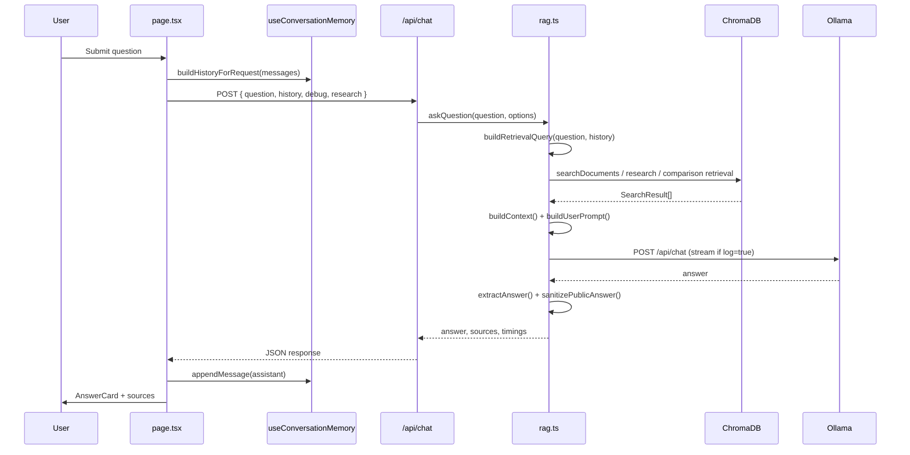
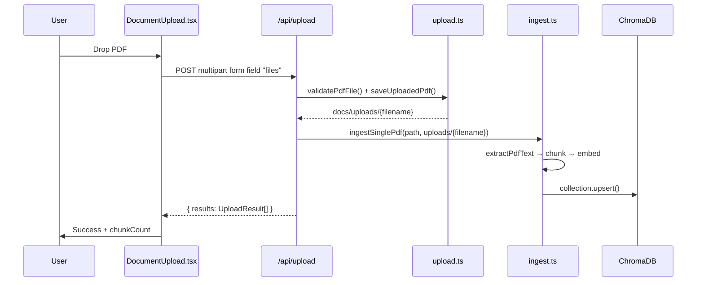
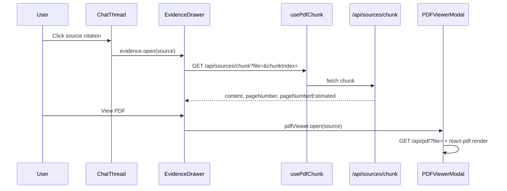

# Architecture

This document describes the system architecture of the Medical RAG Assistant as implemented in the repository.

## Overview

The application is a **Next.js 16** App Router project. The browser UI talks to **Next.js API routes**, which orchestrate document ingestion and the RAG pipeline. **ChromaDB** stores precomputed embeddings. **Ollama** generates answers locally. Embeddings are produced by **@xenova/transformers** (`Xenova/all-MiniLM-L6-v2`).

There is no separate backend service — ingestion scripts and API routes share the same libraries under `src/lib/`.

## System diagram

```mermaid
flowchart TB
    subgraph client [Browser]
        PAGE[src/app/page.tsx]
        EVAL[src/app/evaluation/page.tsx]
        LS[(localStorage)]
    end

    subgraph next [Next.js server]
        API_CHAT[/api/chat]
        API_UP[/api/upload]
        API_DOC[/api/documents]
        API_STATS[/api/stats]
        API_PDF[/api/pdf]
        API_CHUNK[/api/sources/chunk]
        LIB[src/lib/*]
    end

    subgraph scripts [CLI scripts]
        INGEST_SCRIPT[scripts/ingest.ts]
        RESET[scripts/reset-ingest.ts]
    end

    subgraph storage [Local storage]
        DOCS[docs/*.pdf]
        UPLOADS[docs/uploads/*.pdf]
        CHROMA_DIR[chroma/]
    end

    subgraph services [External processes]
        CHROMA_SVC[ChromaDB :8000]
        OLLAMA[Ollama :11434]
    end

    PAGE --> API_CHAT
    PAGE --> API_UP
    PAGE --> API_DOC
    PAGE --> API_STATS
    PAGE --> API_PDF
    PAGE --> API_CHUNK
    PAGE --> LS
    EVAL --> API_CHAT

    API_CHAT --> LIB
    API_UP --> LIB
    API_DOC --> LIB
    API_STATS --> LIB
    API_PDF --> LIB
    API_CHUNK --> LIB
    INGEST_SCRIPT --> LIB
    RESET --> LIB

    LIB --> DOCS
    LIB --> UPLOADS
    LIB --> CHROMA_SVC
    LIB --> OLLAMA
    CHROMA_SVC --> CHROMA_DIR
```

## Layers

| Layer | Location | Responsibility |
|---|---|---|
| **UI** | `src/app/`, `src/components/`, `src/hooks/` | Chat, document library, upload, evidence drawer, PDF viewer, analytics |
| **API** | `src/app/api/` | HTTP boundary; validates input; calls `src/lib` |
| **Core** | `src/lib/` | Ingestion, retrieval, RAG orchestration, memory helpers |
| **Scripts** | `scripts/` | Batch ingest, reset, smoke tests, model benchmark |
| **Vector store** | ChromaDB collection `medical_docs` | Chunk text, metadata, embeddings |
| **LLM** | Ollama | Answer generation via `POST /api/chat` |

## Pages

| Route | File | Purpose |
|---|---|---|
| `/` | `src/app/page.tsx` | Main chat UI, document sidebar, analytics dashboard |
| `/evaluation` | `src/app/evaluation/page.tsx` | Pipeline testing with `debug: true` and run history |

## API routes

| Method | Path | Handler | Calls |
|---|---|---|---|
| `POST` | `/api/chat` | `src/app/api/chat/route.ts` | `askQuestion()` in `rag.ts` |
| `POST` | `/api/upload` | `src/app/api/upload/route.ts` | `saveUploadedPdf()` → `ingestSinglePdf()` |
| `GET` | `/api/documents` | `src/app/api/documents/route.ts` | `getDocumentLibrary()` |
| `GET` | `/api/stats` | `src/app/api/stats/route.ts` | `getSystemStats()` |
| `GET` | `/api/pdf` | `src/app/api/pdf/route.ts` | `assertPdfReadable()` → PDF bytes |
| `GET` | `/api/sources/chunk` | `src/app/api/sources/chunk/route.ts` | `getChunkByReference()` |

## Core modules

| Module | File | Role |
|---|---|---|
| Ingestion | `ingest.ts` | PDF → chunks → embeddings → Chroma upsert |
| PDF extract | `pdf-extract.ts` | Text extraction via `pdf-parse` |
| Chunk IDs | `chunk-id.ts` | `doc-{safe}-chunk-{n}` / `upload-{safe}-chunk-{n}` |
| Embeddings | `embeddings.ts` | Xenova pipeline; mean pooling; L2 normalize |
| Chroma client | `chroma.ts` | `ChromaClient`, collection `medical_docs` |
| Retrieval | `retrieve.ts` | Embed query → Chroma `query()` → similarity scores |
| RAG | `rag.ts` | `askQuestion()` — retrieval, prompt, Ollama, sanitization |
| Conversation | `conversation.ts` | `buildRetrievalQuery()` for memory-aware search |
| Memory | `memory-service.ts` | `localStorage` persistence; `MAX_MEMORY_EXCHANGES = 10` |
| Research / comparison | `research-mode.ts` | Mode detection; topic parsing; per-topic retrieval constants |
| Answer sanitizer | `answer-sanitizer.ts` | Post-process Ollama output |
| Documents | `documents.ts` | List PDFs on disk + Chroma chunk counts |
| Upload | `upload.ts` | Validate, save to `docs/uploads/`, 25 MB limit |
| Stats | `stats.ts` | Index and model metadata for `/api/stats` |
| Session analytics | `session-analytics.ts` | Per-session metrics from chat messages |

## Component interactions (chat flow)



## Component interactions (upload flow)



## Component interactions (evidence flow)



## Data flow

### Document data

```
PDF file
  → pdf-extract.ts (plain text)
  → RecursiveCharacterTextSplitter (1000 / 200)
  → DocumentChunk { id, text, metadata: { filename, chunkIndex } }
  → embeddings.ts (float vector per chunk)
  → ChromaDB upsert (ids, documents, metadatas, embeddings)
```

Metadata `filename` is either a library name (e.g. `IRQ_D1_Hypertension-MOH.pdf`) or an upload path (`uploads/my-file.pdf`).

### Query data

```
User question (+ optional history from localStorage)
  → buildRetrievalQuery() in conversation.ts
  → embedQuery() in embeddings.ts
  → ChromaDB collection.query()
  → SearchResult[] with similarityScore
  → formatChunkBlock() context string
  → buildUserPrompt() + Ollama
  → sanitizePublicAnswer()
  → RagSource[] returned to UI
```

### Client-side persistence

| Key | File | Data |
|---|---|---|
| `medical-rag-conversation` | `memory-service.ts` | Chat messages (max 20 turns) |
| `medical-rag-debug-mode` | `page.tsx` | Debug toggle |
| `medical-rag-research-mode` | `page.tsx` | Research toggle |
| `medical-rag-evaluation-history` | `evaluation-lab.ts` | Evaluation Lab runs (max 50) |

Memory is **client-side only**. The server receives `history` in each `/api/chat` request but does not persist it.

## Retrieval modes

`askQuestion()` in `rag.ts` selects a retrieval path:

| Condition | Function | Retrieval |
|---|---|---|
| Comparison (≥2 topics from question) | `retrieveChunksForComparison()` | 5 chunks per topic (`COMPARISON_PER_TOPIC_K`) |
| `researchMode === true` | `retrieveChunksForResearch()` | Parallel queries, 4 per query (`RESEARCH_PER_TOPIC_K`), merged up to 10 (`RESEARCH_TOP_K`) |
| Default | `searchDocuments()` | Top 3 (`TOP_K`) |

Research mode is enabled when the UI toggle is on **or** `isResearchQuestion()` matches (`research-mode.ts`). Comparison mode is auto-detected from topic extraction.

## External services

### ChromaDB

- Started via `npm run chroma:server` (`chroma run --path ./chroma --host localhost --port 8000`)
- Client config: `CHROMA_HOST`, `CHROMA_PORT`, `CHROMA_SSL` in `chroma.ts`
- Collection: `medical_docs` with `embeddingFunction: null` (embeddings supplied at upsert/query time)

### Ollama

- Default URL: `OLLAMA_BASE_URL` → `http://localhost:11434`
- Default model: `OLLAMA_MODEL` → `qwen2.5:7b`
- Called at `{OLLAMA_BASE_URL}/api/chat`
- Timeouts: `OLLAMA_TIMEOUT_MS`, `RESEARCH_OLLAMA_TIMEOUT_MS`, `COMPARISON_OLLAMA_TIMEOUT_MS`
- `POST /api/chat` route `maxDuration`: 600 s

## UI composition (`page.tsx`)

```
Header (Evaluation Lab link, Research mode, RAG Debug, Clear chat)
RagAnalyticsDashboard (collapsible; stats from /api/stats + session analytics)
├── DocumentLibrary sidebar
│   ├── Document list from /api/documents
│   └── DocumentUpload → /api/upload
└── Chat main panel
    ├── ChatEmptyState + QuerySuggestions (no messages)
    ├── ChatThread (messages, AnswerCard, sources)
    └── ChatComposer + MemoryIndicator
EvidenceDrawer → /api/sources/chunk
PDFViewerModal → /api/pdf
```

## Related documentation

- [RAG_FLOW.md](./RAG_FLOW.md) — step-by-step pipeline detail
- [DEMO_SCRIPT.md](./DEMO_SCRIPT.md) — live demonstration script
- [../README.md](../README.md) — setup and API reference
