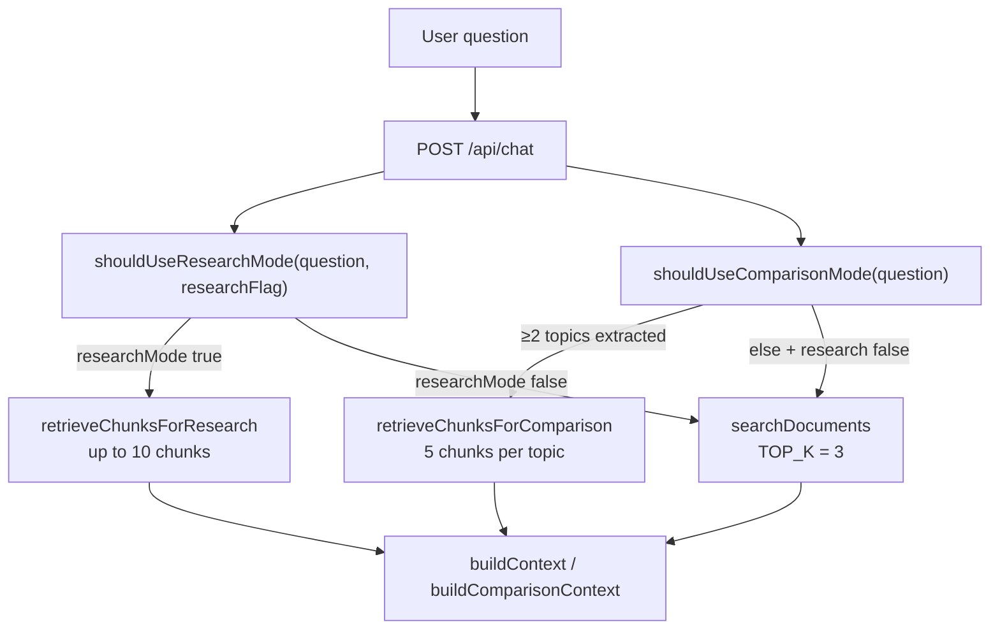

# Multi-Document Retrieval: How It Works Today

## Short answer

**Yes — even with `researchMode: false`, retrieval searches all ingested documents.** There is no single-document filter in standard mode.

What standard mode does **not** do is guarantee chunks from multiple files. It returns the **globally top-3 most similar chunks** from the entire `medical_docs` collection. Those 3 hits may all come from one PDF, or from several PDFs, depending purely on embedding similarity.

---

## Decision tree in `askQuestion()`



Source: `src/lib/rag.ts` (`askQuestion`), `src/app/api/chat/route.ts`.

---

## Standard mode (`researchMode: false`)

### Retrieval

| Aspect | Implementation |
|---|---|
| Entry | `searchDocuments(searchQuery, { topK: 3 })` |
| Collection | Single Chroma collection `medical_docs` — all library + upload PDFs |
| Filter | **None** — no `where` clause on `filename` |
| Query | One embedding of `buildRetrievalQuery(question, history)` |
| Results | Top **3 chunks globally** by L2 distance |

```typescript
// src/lib/retrieve.ts
const result = await collection.query({
  queryEmbeddings: [queryEmbedding],
  nResults: topK,
  include: ["documents", "metadatas", "distances"],
});
```

All PDFs are upserted into the same collection during ingest (`src/lib/ingest.ts` → `src/lib/chroma.ts`). Chunk metadata stores `filename` but retrieval never filters on it.

### Context and prompt

```typescript
// src/lib/rag.ts
const context =
  comparisonMode && comparisonTopics.length >= 2 && chunksByTopic
    ? buildComparisonContext(chunksByTopic)
    : buildContext(chunks, researchMode);
```

When `researchMode` is `false`, `buildContext(chunks, false)` produces a **flat list** of excerpts — not grouped by document:

```typescript
// src/lib/rag.ts — buildContext()
if (!groupByDocument) {
  return chunks
    .map((chunk, index) => formatChunkBlock(chunk, index + 1, maxContentChars))
    .join("\n\n---\n\n");
}
```

The LLM prompt uses the default template ("Answer using only the document excerpts below") — not the structured synthesis layout used in research mode.

---

## Research mode (`researchMode: true`)

Activated when **either**:

- UI toggle / API `"research": true`, **or**
- `isResearchQuestion(question)` matches patterns like `compare`, `synthesize`, `multi-document` (`src/lib/research-mode.ts`)

### What changes (not "enable multi-doc search")

| Aspect | Standard | Research |
|---|---|---|
| Chroma scope | All docs (same collection) | All docs (same collection) |
| Queries | 1 | 1–N parallel (`retrieveChunksForResearch`) |
| Chunks returned | 3 (`TOP_K`) | Up to 10 (`RESEARCH_TOP_K`) |
| Per-query depth | 3 | 4 (`RESEARCH_PER_TOPIC_K`) |
| Context layout | Flat excerpts | Grouped under `=== Document: {filename} ===` |
| Prompt | Simple Q&A | Structured markdown sections |
| `num_predict` | default | 1000 |

Research single-topic path (no comparison topics):

```typescript
// src/lib/rag.ts — retrieveChunksForResearch()
} else if (explicitTopic) {
  queries = [buildTopicRetrievalQuery(explicitTopic, aspect ?? undefined)];
} else {
  queries = [searchQuery];
}
```

So research mode with a single-topic question still runs **one** Chroma query (4 chunks), but uses document-grouped context and a synthesis prompt.

---

## Comparison mode (independent of research toggle)

`shouldUseComparisonMode()` returns `true` when `extractResearchTopics(question)` finds **≥2 topics** (e.g. "diabetes vs hypertension").

- Runs `retrieveChunksForComparison()` — **5 chunks per topic** (`COMPARISON_PER_TOPIC_K`)
- Can activate even when `researchMode: false`
- Uses `buildComparisonContext()` grouped by topic

---

## Query enhancement (all modes)

Before any Chroma search, `buildRetrievalQuery()` in `src/lib/conversation.ts` may expand the embedding text:

- Symptom / diagnosis / cause keyword boosts
- Follow-up pronoun expansion (`expandFollowUpForRetrieval`)
- Recent history (last 4 turns) — **skipped** when the question already names an explicit topic and is not a follow-up

This affects **which chunks rank highest**, not which documents are eligible.

---

## Gap between expectation and behavior

| Expectation | Current behavior |
|---|---|
| "Search all documents" | Already true in standard mode — whole collection is queried |
| "Use evidence from multiple documents" | **Not guaranteed** — top-3 may all be from one dominant PDF |
| "Balance chunks per document" | Not implemented — no per-file quota or MMR diversification |
| "Synthesize across documents" | Requires research/comparison mode for grouped context + structured prompts |

### Example

Question: `"What is hypertension?"` with 3 indexed PDFs (diabetes, hypertension, other):

- Standard mode embeds the question, queries all chunks, returns the 3 highest-similarity hits.
- If the hypertension PDF has the strongest matches, all 3 sources may show `IRQ_D1_Hypertension-MOH.pdf`.
- The diabetes PDF is still **searched** but may not appear in the top 3.

---

## How research mode is set in the UI

```typescript
// src/app/api/chat/route.ts
const researchMode = shouldUseResearchMode(question, researchFlag === true);

// src/app/page.tsx
const useResearch = shouldUseResearchMode(trimmed, researchMode);
```

The header checkbox (`medical-rag-research-mode` in `localStorage`) forces research on. Auto-detection can also enable it from question phrasing without the toggle.

---

## Summary

- **Multi-document search is always on** — Chroma queries the full `medical_docs` index with no filename filter.
- **Research mode is not the switch for multi-document search.** It increases chunk budget, runs parallel queries (when topics/aspects warrant it), groups context by document, and uses synthesis prompts.
- **Standard mode limitation:** only 3 global chunks, flat context, no per-document representation guarantee.

Per-document balancing (e.g. max 1–2 chunks per file, or at least one chunk per indexed PDF) is implemented in **Hybrid Retrieval V2** when `ENABLE_HYBRID_RETRIEVAL=true`. See [docs/HYBRID_RETRIEVAL.md](../docs/HYBRID_RETRIEVAL.md).
