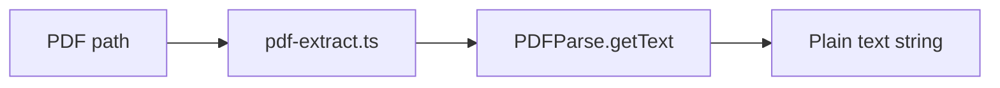
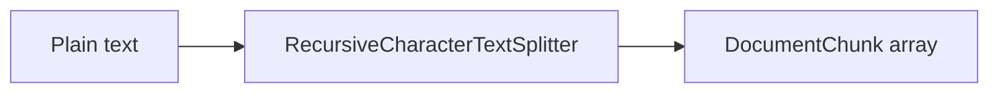
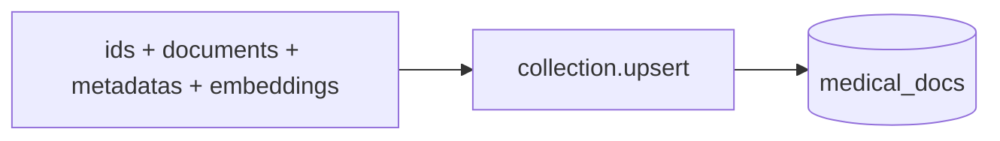
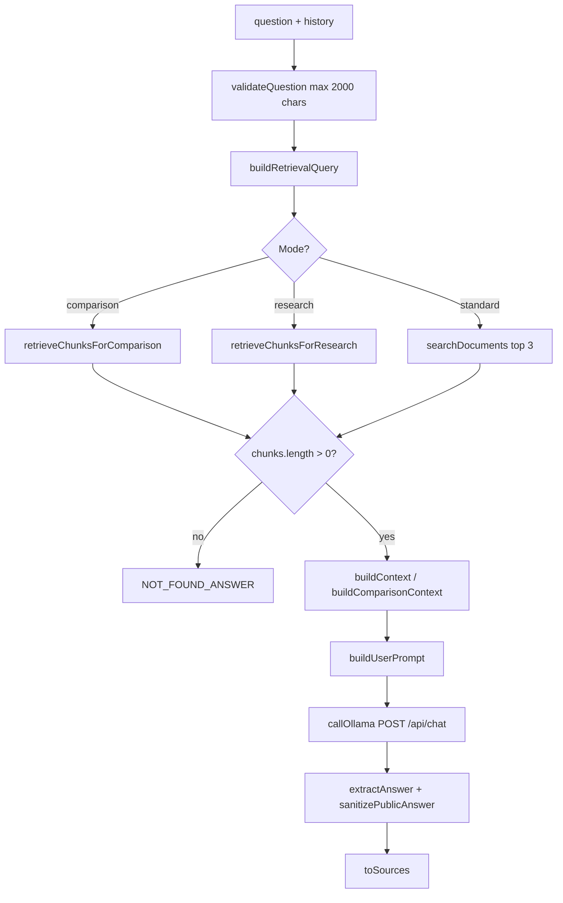

# RAG Flow

This document traces the retrieval-augmented generation pipeline as implemented in `src/lib/`. Two paths exist: **ingestion** (indexing PDFs) and **query** (answering questions).

---

## Part 1: PDF ingestion

Ingestion is triggered by:

- `npm run ingest` → `scripts/ingest.ts` → `ingestDocuments()` — processes `docs/*.pdf` (top level only)
- `POST /api/upload` → `ingestSinglePdf()` — processes one file saved to `docs/uploads/`

Both paths use the same functions in `src/lib/ingest.ts`.

### Step 1: Locate and read PDF



| Detail | Value / location |
|---|---|
| Library PDFs | `docs/{filename}.pdf` |
| Upload PDFs | `docs/uploads/{filename}.pdf` |
| Metadata key | `uploads/{filename}` for uploads |
| Extractor | `pdf-parse` with `pdfjs-dist` worker |
| Failure | `No extractable text in {filename}` if text is empty |

`listPdfFiles()` skips symlink duplicates by comparing `realpath`.

### Step 2: Chunking



| Constant | Value | File |
|---|---|---|
| `CHUNK_SIZE` | 1000 | `ingest.ts` |
| `CHUNK_OVERLAP` | 200 | `ingest.ts` |
| Splitter | `@langchain/textsplitters` | `ingest.ts` |

Each chunk becomes:

```typescript
{
  id: buildChunkId(filename, chunkIndex),
  text: string,
  metadata: { filename, chunkIndex }
}
```

**Chunk ID format** (`chunk-id.ts`):

- Library: `doc-{sanitized-basename}-chunk-{index}`
- Upload: `upload-{sanitized-basename}-chunk-{index}`

Non-alphanumeric characters in the basename are replaced with `-`.

### Step 3: Embedding generation


| Detail | Value | File |
|---|---|---|
| Model | `Xenova/all-MiniLM-L6-v2` | `embeddings.ts` |
| Pooling | `mean` | `embeddings.ts` |
| Normalization | `normalize: true` (L2) | `embeddings.ts` |
| Batch size | 16 (`EMBED_BATCH_SIZE`) | `ingest.ts` |
| Singleton | `embedder` pipeline cached in memory | `embeddings.ts` |

`embedDocuments()` calls `embedText()` per chunk in parallel within each batch.

### Step 4: ChromaDB storage



| Detail | Value | File |
|---|---|---|
| Collection | `medical_docs` | `chroma.ts` |
| Upsert batch | 100 (`UPSERT_BATCH_SIZE`) | `ingest.ts` |
| Embedding function | `null` (manual vectors) | `chroma.ts` |
| Stored metadata | `{ filename, chunkIndex }` | `ingest.ts` |

Re-running ingest upserts the same chunk IDs, updating existing records.

---

## Part 2: Query pipeline

Entry points:

- `POST /api/chat` → `askQuestion()` in `rag.ts`
- `npm run test:retrieval` → `searchDocuments()` only
- `npm run test:rag` → full `askQuestion()`

### Overview



### Step 1: Query enhancement

Before embedding, `buildRetrievalQuery(question, history)` in `conversation.ts` may transform the search string:

| Enhancement | Trigger | Effect |
|---|---|---|
| Symptom boost | `/\b(symptom|signs?)\b/i` | Prepends `{topic} symptoms signs` |
| Diagnosis boost | `/\b(diagnos|diagnosis|diagnosed)\b/i` | Prepends `{topic} diagnosis fasting glucose OGTT` |
| Follow-up expansion | Pronoun pattern in `expandFollowUpForRetrieval()` | Prepends last user turn to short follow-ups |
| Recent history | `history.length > 0` | Appends last 4 turns (trimmed to 300 chars each) |

Topic resolution uses `extractTopicFromQuestion()` or the last user message. Result is capped at 2000 characters.

### Step 2: Retrieval mode selection

In `askQuestion()` (`rag.ts`):

```typescript
const comparisonTopics = extractResearchTopics(query);
const comparisonMode = shouldUseComparisonMode(query, researchMode);
// comparison: extractResearchTopics returns ≥ 2 topics

if (comparisonMode && comparisonTopics.length >= 2) {
  // retrieveChunksForComparison
} else if (researchMode) {
  // retrieveChunksForResearch
} else {
  // searchDocuments(searchQuery, { topK: 3 })
}
```

| Mode | Constant | Retrieval behavior |
|---|---|---|
| Standard | `TOP_K = 3` | Single `searchDocuments()` call |
| Research | `RESEARCH_PER_TOPIC_K = 4`, `RESEARCH_TOP_K = 10` | One or more parallel queries; dedupe; sort by score; slice to 10 |
| Comparison | `COMPARISON_PER_TOPIC_K = 5` | One query per topic via `buildTopicRetrievalQuery()`; dedupe across topics |

### Step 3: Embedding generation (query)

`searchDocuments()` in `retrieve.ts`:

1. Validate question (non-empty, ≤ 2000 chars)
2. `queryEmbedding = await embedQuery(query)` — same Xenova model as ingestion
3. Log embedding dimension when `RAG_LOG=true`

### Step 4: Chroma retrieval

```typescript
const result = await collection.query({
  queryEmbeddings: [queryEmbedding],
  nResults: topK,
  include: ["documents", "metadatas", "distances"],
});
```

Each hit becomes a `SearchResult`:

```typescript
{
  id, content, metadata: { filename, chunkIndex },
  distance, similarityScore
}
```

**Similarity conversion** (`distanceToSimilarityScore`):

```
similarity = 1 - (distance² / 2)    // for L2-normalized vectors
```

Clamped to `[0, 1]`, rounded to 2 decimal places.

If `ids.length === 0`, the pipeline returns:

```
answer: "I could not find this information in the uploaded documents."
sources: []
```

without calling Ollama.

### Step 5: Context assembly

`buildContext(chunks, researchMode)` formats chunks for the prompt.

**Standard / research (non-comparison):**

```
[{filename} · excerpt 1]
{chunk text}

---

[{filename} · excerpt 2]
{chunk text}
```

- Research mode (`groupByDocument = true`): groups under `=== Document: {filename} ===`
- Research truncates chunks to `RESEARCH_CHUNK_MAX_CHARS = 650`
- Comparison uses `buildComparisonContext()` grouped by topic (`=== Topic: {topic} ===`), max `COMPARISON_CHUNK_MAX_CHARS = 500` per chunk

Similarity scores are **not** included in the Ollama context string. They appear only in `RagSource` objects returned to the client.

### Step 6: Prompt construction

`buildUserPrompt()` in `rag.ts` selects a template based on mode:

| Condition | Template |
|---|---|
| Comparison (≥2 topics) | Structured markdown: Symptoms / Diagnosis / Treatment per topic + Key Differences table |
| Research + ≥2 topics | Synthesis with per-topic sections + comparison table |
| Research (single topic) | `## {Topic}` + `### {Aspect or Key Points}` bullets |
| History present | Conversation block via `buildPromptHistorySection()` + document excerpts |
| Default | Document excerpts + `ANSWER_STYLE_RULES` |

All templates include:

- `TABLE_FIGURE_RULES` — avoid dangling table/figure references
- `NOT_FOUND_ANSWER` fallback phrase when context is insufficient
- Qwen3 prefix `/no_think` when `isQwen3Model(model)` and thinking is off

History section format (`memory-service.ts`):

```
Conversation History:
User: ...
Assistant: ...

Current Question:
{question}
```

### Step 7: LLM generation

`callOllama()` posts to `{OLLAMA_BASE_URL}/api/chat`:

| Setting | Source |
|---|---|
| Model | `options.model ?? OLLAMA_MODEL` (default `qwen2.5:7b`) |
| Temperature | `0` (`OLLAMA_OPTIONS`) |
| `num_predict` | 1400 (comparison), 1000 (research), unset (standard) |
| Timeout | `OLLAMA_TIMEOUT_MS` / `RESEARCH_OLLAMA_TIMEOUT_MS` / `COMPARISON_OLLAMA_TIMEOUT_MS` |
| Streaming | Enabled when `log=true` (dev / `RAG_LOG`) |

Response processing:

1. `extractAnswer()` — strips thinking blocks; handles Qwen3 `/no_think` artifacts
2. `sanitizePublicAnswer()` in `answer-sanitizer.ts` — removes meta-leakage and dangling table/figure refs
3. `toSources()` — maps chunks to `{ file, score, chunkIndex, excerpt }` (excerpt max 220 chars)

### Step 8: API response

`POST /api/chat` returns:

```typescript
{
  answer: string,
  sources: RagSource[],
  researchMode: boolean,
  comparisonMode: boolean,
  comparisonTopics: string[],
  topicSources: TopicSourceGroup[],  // comparison mode only
  memory: { used: boolean, messagesIncluded: number },
  debug?: RagDebugInfo   // when debug: true
}
```

When `debug: true`, the payload adds `prompt`, `chunks`, `timings` (`retrievalMs`, `generationMs`, `totalMs`), and `models`.

### Step 9: Client post-processing

`page.tsx` after `/api/chat`:

- `computeAnswerConfidence(sources)` — average similarity × 100
- `timings` from server debug, or `estimateTimings(totalMs)` if debug is off
- Messages persisted to `localStorage` key `medical-rag-conversation`

---

## Constants reference

| Name | Value | File |
|---|---|---|
| `TOP_K` | 3 | `rag.ts` |
| `RESEARCH_TOP_K` | 10 | `research-mode.ts` |
| `RESEARCH_PER_TOPIC_K` | 4 | `research-mode.ts` |
| `COMPARISON_PER_TOPIC_K` | 5 | `research-mode.ts` |
| `CHUNK_SIZE` | 1000 | `ingest.ts` |
| `CHUNK_OVERLAP` | 200 | `ingest.ts` |
| `EMBED_BATCH_SIZE` | 16 | `ingest.ts` |
| `UPSERT_BATCH_SIZE` | 100 | `ingest.ts` |
| `MAX_MEMORY_EXCHANGES` | 10 | `memory-service.ts` |
| `MAX_CONTEXT_TURNS` | 20 | `memory-service.ts` |
| `MAX_TURN_CONTENT_CHARS` | 600 | `memory-service.ts` |
| `COLLECTION_NAME` | `medical_docs` | `chroma.ts` |
| `EMBEDDING_MODEL` | `Xenova/all-MiniLM-L6-v2` | `embeddings.ts` |

---

## Related documentation

- [ARCHITECTURE.md](./ARCHITECTURE.md) — system components and interactions
- [DEMO_SCRIPT.md](./DEMO_SCRIPT.md) — live walkthrough
- [../README.md](../README.md) — setup commands
