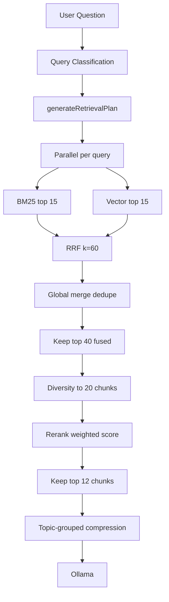

# Hybrid Retrieval V2

Production hybrid retrieval for the Medical RAG assistant. All tuning lives in [`src/lib/search/retrieval.config.ts`](../src/lib/search/retrieval.config.ts).

Enable with `ENABLE_HYBRID_RETRIEVAL=true`.

## Goals

1. **Primary:** Maximize answer completeness and source diversity
2. **Secondary:** Keep retrieval latency under 2 seconds (target 1500ms)
3. **Tertiary:** Keep context under LLM limits (3000–5000 tokens target, 6000 max)

## Architecture



## Phase 1 — Query classification

| Class | Query count | Example |
|---|---|---|
| `direct_qa` | 1–2 | "What are symptoms of diabetes?" |
| `research` | 5–8 | "Explain diabetes" |
| `comparison` | 8–12 | "Compare diabetes and hypertension" |
| `exploratory` | 5–8 | "Survey documents on diabetes" |
| `follow_up` | 1–2 | "What are its symptoms?" (with history) |

## Phase 2 — Dual retrieval

Per planned query (parallel):

- BM25: `HYBRID_BM25_TOP_K` = **15**
- Vector: `HYBRID_VECTOR_TOP_K` = **15**

Research example (6 queries): up to **180** raw candidates before deduplication.

## Phase 3 — Fusion

Reciprocal Rank Fusion: `RRF = Σ 1/(60 + rank)`

After global dedupe across queries → keep **top 40** (`HYBRID_FUSION_TOP_K`).

## Phase 4 — Diversity

- Max **3** chunks per document (preferred **2**)
- Section spread: skip chunks within **2** indices of same document
- Minimum **4** source documents when possible
- Output: **20** chunks (`HYBRID_DIVERSITY_TOP_K`)

## Phase 5 — Reranking

```
finalScore =
  0.45 × normRRF
+ 0.25 × normVector
+ 0.15 × normBM25
+ diversityBonus
```

Diversity bonus (additive):

- **+0.15** first chunk from a new document
- **+0.05** first chunk from a new section

Output: **12** chunks (`HYBRID_FINAL_TOP_K`).

## Phase 6 — Context construction

- Group by topic label (Symptoms, Diagnosis, Treatment, etc.)
- Compress each chunk to **250–400 tokens** (~1000–1600 chars)
- Preserve medical terms, numbers, dosages, lists, tables
- Total budget: **4000 tokens target**, **6000 tokens max**

## Phase 7–9 — Metrics and failure detection

| Metric | Description |
|---|---|
| `documentCoverage` | Unique documents in final set |
| `documentCoverageRatio` | uniqueDocs / docs in fused pool |
| `topicCoverage` | Topic labels represented |
| `topicCoverageRatio` | coveredTopics / expectedTopics |
| `retrievalConfidence` | Average of top-5 final scores |

**`LOW_RETRIEVAL_CONFIDENCE`** when:

- Top score < **0.55**, OR
- Document coverage < **2**, OR
- Final chunks < **4**

## Debug output

```typescript
{
  queryPlan: RetrievalPlan,
  stageCounts: {
    bm25ResultsCount,
    vectorResultsCount,
    fusedResultsCount,
    diversityResultsCount,
    finalContextChunks,
    uniqueDocuments,
  },
  retrievalMetrics: {
    retrievalLatency,
    retrievalConfidence,
    lowRetrievalConfidence,
    performanceWarnings,
    ...
  }
}
```

## Performance targets

| Stage | Target |
|---|---|
| Query planning | < 100ms |
| BM25 | < 100ms |
| Vector search | < 500ms |
| Fusion | < 50ms |
| Reranking | < 50ms |
| **Total** | **< 1500ms** |

Warnings surface in `retrievalMetrics.performanceWarnings` when exceeded.

## Configuration

All values in `RETRIEVAL_CONFIG` — override via env vars:

| Variable | Default |
|---|---|
| `ENABLE_HYBRID_RETRIEVAL` | `false` |
| `HYBRID_BM25_TOP_K` | `15` |
| `HYBRID_VECTOR_TOP_K` | `15` |
| `HYBRID_RRF_K` | `60` |
| `HYBRID_FUSION_TOP_K` | `40` |
| `HYBRID_DIVERSITY_TOP_K` | `20` |
| `HYBRID_FINAL_TOP_K` | `12` |
| `HYBRID_MAX_PER_DOCUMENT` | `3` |
| `HYBRID_PREFERRED_PER_DOCUMENT` | `2` |
| `HYBRID_MIN_SOURCE_DOCUMENTS` | `4` |
| `HYBRID_CONTEXT_TARGET_TOKENS` | `4000` |
| `HYBRID_CONTEXT_MAX_TOKENS` | `6000` |
| `HYBRID_LOW_CONFIDENCE_THRESHOLD` | `0.55` |

## Tests

```bash
npm run test:planner
npm run test:rrf
npm run test:diversity
npm run test:hybrid
```

## V1 vs V2

| Aspect | V1 | V2 |
|---|---|---|
| Planner | Regex branches | 5-class query plan |
| Per-query K | 10 | 15 BM25 + 15 vector |
| Fusion cap | Per-query | Global top 40 |
| Diversity | Max 3/doc | Max 3, prefer 2, section spread |
| Final chunks | 3–10 | **12** |
| Rerank weights | 0.5/0.2/0.2/0.1 | 0.45/0.25/0.15 + bonus |
| Failure detection | None | LOW_RETRIEVAL_CONFIDENCE |
